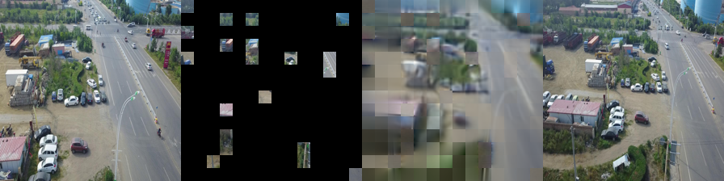
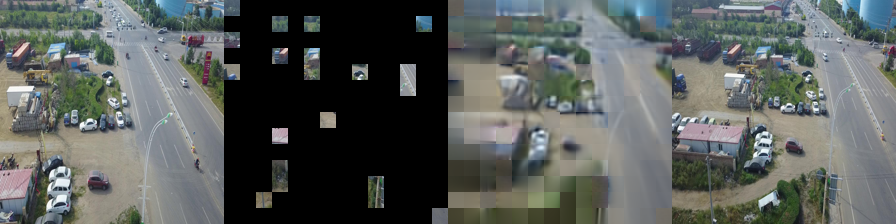
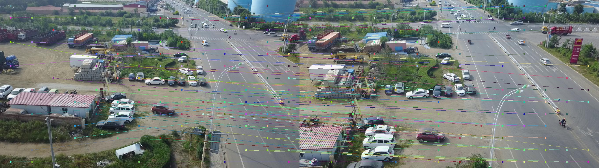
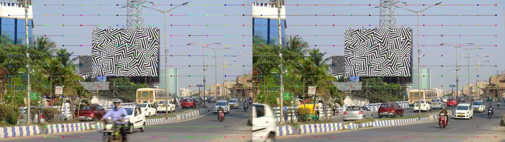

# CroCo-LoRA: Improving CroCo Representations for Relative Pose Estimation

[[`CroCo arXiv`](https://arxiv.org/abs/2210.10716)]

This repository contains an adaptation of the [CroCo: Self-Supervised Pre-training for 3D Vision Tasks by Cross-View Completion](https://openreview.net/pdf?id=wZEfHUM5ri) framework with [LoRA-based](https://arxiv.org/abs/2106.09685) fine-tuning and an evaluation pipeline for relative camera pose estimation on drone video datasets.

The goal of this project is to investigate whether fine-tuning CroCo using LoRA improves downstream geometric tasks, specifically relative pose estimation between frames
## CroCo Architecture 


# License

This repository follows the license of the [Original CroCo Project](https://github.com/naver/croco/tree/master)


---

# Installation

This repository extends the original **CroCo** framework with LoRA-based fine-tuning and evaluation scripts for **relative pose estimation**.

Follow the steps below to set up the environment and install all required dependencies.

---

## 1. Clone the Repository

```bash
git clone https://github.com/Karimashraf01/croco_lora.git
cd croco_lora
```

---

## 2. Create a Python Environment

It is recommended to use **conda** for managing dependencies.

Our experiments were conducted on an **RTX 5070 (SM_120)** GPU using **Python 3.10** and **PyTorch 2.12.0 with CUDA 12.8**.

You may install versions compatible with your hardware and CUDA setup.

```bash
conda create -n croco_lora python=3.10
conda activate croco_lora
```

---

## 3. Install PyTorch (CUDA 12.8)

Install PyTorch according to your CUDA version.

Example for **PyTorch 2.12.0 with CUDA 12.8**:

```bash
pip install torch==2.12 torchvision torchaudio --index-url https://download.pytorch.org/whl/cu128
```

Verify the installation:

```bash
python -c "import torch; print(torch.cuda.is_available())"
```

---

## 4. Install Python Dependencies

Install the remaining required packages:

```bash
pip install timm
pip install transformers
pip install peft
pip install opencv-python
pip install numpy matplotlib pandas
pip install scikit-learn scipy
pip install einops tqdm
pip install tensorboard
```

---

## 5. Compile CUDA Kernels for RoPE

CroCo v2 uses **RoPE (Rotary Positional Embeddings)** implemented with custom CUDA kernels for improved efficiency.

Compile the CUDA kernels using:

```bash
cd models/curope
python setup.py build_ext --inplace
cd ../../
```

This step may take some time because the kernels are compiled for multiple CUDA architectures.

If you are using a custom CUDA installation, you may need to set the environment variable `CUDA_HOME`.

Example:

Linux:

```bash
export CUDA_HOME=/usr/local/cuda
```

Windows:

```bash
set CUDA_HOME=C:\Program Files\NVIDIA GPU Computing Toolkit\CUDA\v12.x
```

---

## RTX 50 Series GPUs (SM_120)

For newer GPUs such as the **RTX 50xx series (SM_120)**, the CUDA kernels may require small modifications in order to compile correctly.

If the CUDA kernels fail to compile, CroCo will automatically fall back to a **pure PyTorch implementation of RoPE**.

This fallback version is slower but allows the model to run without CUDA kernel compilation.

You may see the following warning:

```bash
Warning: cannot find cuda-compiled version of RoPE2D, using a slow PyTorch version instead
```

The model will still run correctly in this mode.

# Data and Pretrained Weights

This project uses two types of data:

1. **VisDrone-Dataset (Unlabeled images)** for CroCo pretraining / LoRA fine-tuning.
2. **Labeled video sequences (Drone videos with COLMAP-format annotations)** for evaluating relative pose estimation.

Large datasets and model checkpoints are **not included in this repository** and must be downloaded separately.

---

# 1. Pretrained CroCo Weights
Orignal Croco repository  provides several pre-trained models:

| modelname                                                                                                                          | pre-training data | pos. embed. | Encoder | Decoder |
|------------------------------------------------------------------------------------------------------------------------------------|-------------------|-------------|---------|---------|
| [`CroCo.pth`](https://download.europe.naverlabs.com/ComputerVision/CroCo/CroCo.pth)                                                 | Habitat           | cosine      | ViT-B   | Small   |
| [`CroCo_V2_ViTBase_SmallDecoder.pth`](https://download.europe.naverlabs.com/ComputerVision/CroCo/CroCo_V2_ViTBase_SmallDecoder.pth) | Habitat + real    | RoPE        | ViT-B   | Small   |
| [`CroCo_V2_ViTBase_BaseDecoder.pth`](https://download.europe.naverlabs.com/ComputerVision/CroCo/CroCo_V2_ViTBase_BaseDecoder.pth)   | Habitat + real    | RoPE        | ViT-B   | Base    |
| [`CroCo_V2_ViTLarge_BaseDecoder.pth`](https://download.europe.naverlabs.com/ComputerVision/CroCo/CroCo_V2_ViTLarge_BaseDecoder.pth) | Habitat + real    | RoPE        | ViT-L   | Base    |

To download a specific model, (e.g.) (`CroCo_V2_ViTBase_BaseDecoder.pth`)
```bash
mkdir -p pretrained_models/
wget https://download.europe.naverlabs.com/ComputerVision/CroCo/CroCo_V2_ViTBase_BaseDecoder.pth -P pretrained_models/
```

In our experiments we used:
```
CroCo_V2_ViTBase_SmallDecoder.pth
```

Place the checkpoint inside the following directory:

```
pretrained_models/
```

Example structure:

```
croco_lora
│
├── pretrained_models
│   └── CroCo_V2_ViTBase_SmallDecoder.pth
```

This checkpoint is used as the base model before applying LoRA fine-tuning.

---

# 2. Unlabeled Image Dataset (for LoRA Fine-Tuning)

We use the **VisDrone2019 dataset** as the unlabeled image dataset for fine-tuning CroCo.

Download the dataset from the official website:

https://github.com/VisDrone/VisDrone-Dataset

We use the dataset from section:

```
Task 1: Object Detection in Images
```

The following splits are used:

```
VisDrone2019-DET-train
VisDrone2019-DET-val
VisDrone2019-DET-test-dev
```

Place the dataset inside:

```
New_drone_dataset/
```

Example structure:

```
New_drone_dataset
│
├── VisDrone2019-DET-train
├── VisDrone2019-DET-val
└── VisDrone2019-DET-test-dev
```

These images are used for **self-supervised CroCo fine-tuning with LoRA**.
# Generate Training Pairs

CroCo training requires image pairs.  
To generate the training, validation, and testing pair files run:
```bash
python generate_croco_pairs.py \
    --images_dir New_drone_dataset/VisDrone2019-DET-train/images \
    --output_txt New_drone_dataset/croco_pairs_train.txt

python generate_croco_pairs.py \
    --images_dir New_drone_dataset/VisDrone2019-DET-val/images \
    --output_txt New_drone_dataset/croco_pairs_val.txt

python generate_croco_pairs.py \
    --images_dir New_drone_dataset/VisDrone2019-DET-test-dev/images \
    --output_txt New_drone_dataset/croco_pairs_test_dev.txt
```

These output files contain sequential image pairs used during **CroCo masked reconstruction training**.
Each line follows the format:
```
New_drone_dataset/VisDrone2019-DET-train/VisDrone2019-DET-train/images/0000002_00005_d_0000014.jpg New_drone_dataset/VisDrone2019-DET-train/VisDrone2019-DET-train/images/0000002_00448_d_0000015.jpg
New_drone_dataset/VisDrone2019-DET-train/VisDrone2019-DET-train/images/0000007_04999_d_0000036.jpg New_drone_dataset/VisDrone2019-DET-train/VisDrone2019-DET-train/images/0000007_05499_d_0000037.jpg
...
```

## Pair Filtering Using Visual Place Recognition
The CroCo paper mentions that the dataset used for pretraining contains approximately **50% covisibility between image pairs**.

To approximate this property, the generated pairs can be filtered by [DINOv2 SALAD (Visual Place Recognition model)](https://github.com/serizba/salad) using the following commands:
```bash
python New_drone_dataset/filter_pairs.py --pairs_txt New_drone_dataset/croco_pairs_train.txt
python New_drone_dataset/filter_pairs.py --pairs_txt New_drone_dataset/croco_pairs_val.txt
python New_drone_dataset/filter_pairs.py --pairs_txt New_drone_dataset/croco_pairs_test_dev.txt
```

The structure will be as the following:

```
New_drone_dataset
│
├── VisDrone2019-DET-train
│   └── images
├── VisDrone2019-DET-val
│   └── images
├── VisDrone2019-DET-test-dev
│   └── images
├── croco_pairs_train.txt
├── croco_pairs_val.txt
├── croco_pairs_test_dev.txt
├── croco_pairs_train_filtered.txt
├── croco_pairs_val_filtered.txt
└── croco_pairs_test_dev_filtered.txt

```
---

# 3. Labeled Video Dataset (Relative Pose Evaluation)

For evaluating relative pose estimation, we use drone video sequences with **ground truth camera poses**.

to download the dataset, available at this Google Drive [link](https://drive.google.com/drive/folders/1TEwxPu662sw0hg8MPHsYY8lesiXIzAqM)  but may require access permissions, and place it inside the following directory:

```
labeled_videos/
```

Each video directory contains:

```
video_1
│
├── video_1.mp4
├── gt/colmap
│   ├── images.txt
│   ├── points3D.txt
│   └── camera.txt
```
- `video_1.mp4` is the original video file.
- `images.txt`, `points3D.txt`, and `camera.txt` are the COLMAP output files containing the ground truth camera poses and 3D points.

to extract the ground truth relative poses between frames, you can use the `extract_gt_poses.py` script, which parses the COLMAP output and generates a text file with the relative poses between selected frame pairs.
it will loop all videos in the `labeled_videos/` directory and generate a corresponding `pairs_with_pose.txt` file in each video directory.
```
python labeled_videos/extract_gt.py 
```
the generated `pairs_with_pose.txt` file will contain lines in the following format:

```
img_000000.jpg img_000020.jpg r11 r12 r13 r21 r22 r23 r31 r32 r33 tx ty tz
```

Where:

- `R` (3×3) represents the **ground truth rotation matrix**
- `t` (3×1) represents the **ground truth translation vector**


These sequences are used to evaluate **Relative Pose Estimation**.

---
### Note
[NYU Depth v2](https://cs.nyu.edu/~fergus/datasets/nyu_depth_v2.html) dataset was also used to evaluate the performance of CroCo after adding LoRA to the pre-trained model, to evaluate the performance of old data domain after fine-tuning on the new drone dataset.


---
# Masked Reconstruction

CroCo is originally trained using a **masked image reconstruction task**.  
Given two views of a scene, CroCo masks a portion of the patches from one view and learns to reconstruct them using information from the second view.

In this repository we evaluate how **LoRA-based fine-tuning affects CroCo's masked reconstruction ability**.

Three training approaches are implemented:

| Script | Description |
|------|------|
| `pretrain.py` | Baseline CroCo masked reconstruction training |
| `pretrain_lora.py` | CroCo fine-tuning with custom LoRA layers |
| `pretrain_peft.py` | CroCo fine-tuning using the PEFT LoRA implementation |

---

# Training

To train the baseline CroCo reconstruction model:

```bash
python pretrain.py
```

To train CroCo with **LoRA adaptation**:

```bash
python pretrain_lora.py --experiment_name "croco_lora_finetuning" --training_pairs_file croco_pairs_train.txt  --val_pairs_file croco_pairs_val.txt --lora_rank 16 --lora_alpha 32 --lora_qkv_only 1 --lora_enc_only 1
```

To train CroCo using **PEFT LoRA modules** (better initialization):

```bash
python pretrain_peft.py --experiment_name "croco_lora_finetuning" --training_pairs_file croco_pairs_train.txt  --val_pairs_file croco_pairs_val.txt --lora_rank 16 --lora_alpha 32 --lora_qkv_only 1 --lora_enc_only 1
```

During training, the model learns to reconstruct masked patches from paired images generated from the VisDrone dataset.

---

# Evaluation (Reconstruction Demo)

After training, reconstruction results can be visualized using the demo scripts.

Baseline CroCo reconstruction:

```bash
python demo.py
```

CroCo with LoRA reconstruction:

```bash
python demo_lora.py
```

CroCo with PEFT-based LoRA reconstruction:

```bash
python demo_lora_peft.py 
```

These scripts visualize the masked input patches and the model's reconstructed output.

and for evalution on dataset of pairs you can run the following command, which will compute the reconstruction loss on the validation set :
for the baseline CroCo model:
```bash
python eval.py --pairs_txt croco_pairs_val.txt --data_dir New_drone_dataset/VisDrone2019-DET-val 
```
for the PEFT LoRA fine-tuned model:
```bash
python eval_peft.py --checkpoint checkpoint-LoRA_on_ENCODER_Decoder_r16_peft-best.pth --pairs_txt croco_pairs_val.txt --data_dir New_drone_dataset/VisDrone2019-DET-val 
```

---

# Reconstruction Comparison

The reconstruction quality can be compared between the baseline CroCo model and the LoRA-adapted versions.

| Model |  Masked MSE Loss ↓ | Notes |
|------|------|------|
| CroCo (baseline) | 0.5004| Pretrained model |
| CroCo + LoRA_r16 |0.4724 | Fine-tuned with LoRA |
| CroCo + LoRA_r16 (PEFT) | **0.4647** | Fine-tuned using PEFT| 


On the filtered dataset with higher covisibility between pairs, the losses are as the following:
| Model |  Masked MSE Loss ↓ | Notes |
|------|------|------|
| CroCo (baseline) | 0.4513| Pretrained model |
| CroCo + LoRA_r16 (PEFT) | **0.3965** | Fine-tuned on filtered pairs dataset|

 Lower reconstruction loss indicates better masked reconstruction performance.

## Visual Reconstruction Comparison
Baseline CroCo reconstruction Masked MSE Loss: 0.5766

CroCo with LoRA reconstruction Masked MSE Loss: 0.5163

CroCo with PEFT-based LoRA reconstruction Masked MSE Loss: 0.5054

CroCo with PEFT-based LoRA reconstruction on filtered pairs dataset Masked MSE Loss: 0.4884

---

# Scripts Overview

| Script | Purpose |
|------|------|
| `pretrain.py` | Baseline CroCo masked reconstruction training |
| `pretrain_lora.py` | LoRA-based fine-tuning implementation |
| `pretrain_peft.py` | PEFT-based LoRA training |
| `demo.py` | Visualize baseline reconstruction |
| `demo_lora.py` | Visualize LoRA reconstruction |
| `demo_lora_peft.py` | Visualize PEFT-LoRA reconstruction |
| `eval.py` | Evaluate reconstruction loss on validation set |
| `eval_peft.py` | Evaluate PEFT-LoRA reconstruction loss on validation set |   


---
# Relative Pose Estimation

After fine-tuning CroCo using LoRA, we evaluate the learned visual representations on a **relative camera pose estimation task**.

The goal is to estimate the **relative rotation and translation between two frames** extracted from drone videos.

Ground truth camera poses are provided in **COLMAP format**, which allows us to compute the relative transformation between frames.

---

## Pipeline

1. **Feature Extraction**

   CroCo extracts dense patch features from both images.

2. **Dense Feature Matching**

   Cosine similarity matching is performed between CroCo patch features to obtain correspondences between the two images.

#### Visualization of the matched features



3. **Relative Pose Estimation**

   The **Essential Matrix** is estimated using `cv2.findEssentialMat` and filtered using **RANSAC**.

4. **Pose Recovery**

   The relative rotation \(R\) and translation direction \(t\) are recovered using:

   ```
   cv2.recoverPose()
   ```

5. **Pose Error Evaluation**

   The predicted pose is compared against the **ground truth pose extracted from COLMAP**.

---

## Running Relative Pose Evaluation

To run relative pose estimation on a labeled video sequence:

```bash
python relative_pose_video_demo.py --video VIDEO_NAME
```

Example:

```bash
python relative_pose_video_demo.py --video 00444043_ES04
```

---

### With LoRA Fine-Tuned CroCo

To evaluate the LoRA-adapted model:

```bash
python relative_pose_video_demo.py --video VIDEO_NAME --use_lora
```

Example:

```bash
python relative_pose_video_demo.py --video 00444043_ES04 --use_lora
```

---

## Output

For each image pair the script reports:

```
img_000000.jpg -> img_000020.jpg | matches=36 | rot=0.04° | trans=41.26°
```

Where:

- **matches**: number of feature correspondences
- **rot**: relative rotation error (degrees)
- **trans**: relative translation direction error (degrees)

---

## Evaluation Metrics

We use the following metrics to evaluate relative pose estimation.

### Relative Rotation Error (RRE)

Measures the angular difference between predicted and ground truth rotations:

```
RRE = arccos((trace(R_pred R_gt^T) - 1) / 2)
```

Unit: **degrees**

---

### Relative Translation Error (RTE)

Measures the angular difference between predicted and ground truth translation directions:

```
RTE = arccos( (t_pred ⋅ t_gt) / (||t_pred|| ||t_gt||) )
```

Unit: **degrees**

Lower values indicate **better relative pose estimation performance**.

---


## Evaluation Results

| Video Sequence | Baseline CroCo RRE (°) | Baseline CroCo RTE (°) | LoRA CroCo RRE (°) | LoRA CroCo RTE (°) |
|----------------|------------------------|------------------------|--------------------|--------------------|
| 00444043_ES04 | 0.0578 | 67.1996 | 0.0578 | 67.1996 |
| 00444043_ES05 | 1.6906 | 36.0733 | 2.1139 | 36.0733 |
| 3010040645-DM4K_es03 | 0.0781 | 54.8986 | 0.0889 | 54.8986 |

Lower **RRE** and **RTE** values indicate better relative pose estimation performance.

---

### Discussion

The results between the baseline CroCo model and the LoRA fine-tuned model are very similar, with differences appearing only at very small decimal precision.

This behavior is mainly due to the approximation used in the dense feature matching step. Each feature vector represents a **patch**, and we approximate the feature location using the **center of the patch**. In practice, the true visual correspondence may lie anywhere inside the patch, which introduces small localization noise.

Additionally, the motion between frames in several videos is extremely small, and in some cases the camera is almost static. This makes establishing a stable baseline challenging, as even small matching noise can affect the estimated pose.

Another important factor is the **large translation error (RTE)** observed in some sequences. Since the translation is estimated only from **2D correspondences without depth information**, small localization errors in the feature matches can significantly affect the estimated translation direction. When the camera motion between frames is very small, even minor noise in the correspondences can lead to large angular deviations in the recovered translation vector.

The following image illustrates an example where the patch-center approximation and still camera motion affect the matching quality:



---

# Repository Structure

The main scripts in this repository are organized as follows:

```
croco_lora
│
├── models/                      # CroCo model implementation
├── pretrained_models/           # Pretrained CroCo checkpoints
├── labeled_videos/              # Drone video dataset for pose evaluation
├── New_drone_dataset/           # VisDrone dataset used for fine-tuning
├── assets/                      # Images used in the README
│
├── pretrain.py                  # Baseline CroCo masked reconstruction training
├── pretrain_lora.py             # CroCo training with custom LoRA layers
├── pretrain_peft.py             # CroCo training using PEFT LoRA
│
├── demo.py                      # Reconstruction demo (baseline CroCo)
├── demo_lora.py                 # Reconstruction demo (LoRA)
├── demo_lora_peft.py            # Reconstruction demo (PEFT LoRA)
│
├── eval.py                      # Reconstruction loss evaluation
├── eval_peft.py                 # Reconstruction evaluation for PEFT LoRA
│
├── relative_pose_demo.py        # Relative pose estimation between image pairs
├── relative_pose_video_demo.py  # Relative pose estimation on video sequences
│
└── generate_croco_pairs.py      # Script to generate training image pairs
```

---

# Future Work

While this project explores the impact of LoRA fine-tuning on CroCo representations for relative pose estimation, several directions remain open for further research and improvement.

### Improving Feature Localization
Currently, patch features extracted from CroCo represent entire image patches, and their locations are approximated using the **patch center**. Future work could explore **sub-patch localization** or **keypoint refinement techniques** to reduce correspondence noise and improve pose estimation accuracy.

### Dense Matching Improvements
The current implementation uses **cosine similarity matching** between patch features. Future improvements could include:

- Feature refinement using **cross-attention matching**
- Integration with **transformer-based matchers** (e.g., LightGlue or SuperGlue)
- Multi-scale feature matching

These approaches may produce more accurate correspondences and increase RANSAC inlier counts.

### Better Translation Estimation
Large translation errors were observed in some sequences due to small camera motion and noisy correspondences. Future work could explore:

- **Triangulation-based pose estimation**
- **PnP with reconstructed 3D points**
- Multi-frame pose estimation instead of pairwise estimation

These approaches may improve the stability of translation recovery.

### Larger Motion Benchmarks
Some video sequences contain very small motion between frames, making pose estimation difficult to evaluate. Future work could include:

- Datasets with **larger camera motion**
- **longer frame baselines**
- outdoor **SLAM-style sequences**

This would allow for more robust evaluation of learned geometric representations.


### Downstream 3D Vision Tasks
Finally, the learned representations could be evaluated on additional **3D vision tasks**, such as:

- Optical flow estimation
- Image matching 
- structure-from-motion
- monocular SLAM

This would provide a more comprehensive understanding of how LoRA fine-tuning affects the geometric capabilities of CroCo.
# Citation

If you find this repository useful in your research, please consider citing the original CroCo and LoRA papers:

```
@article{croco2022,
  title={CroCo: Self-Supervised Pre-training for 3D Vision Tasks by Cross-View Completion},
  author={Weinzaepfel, Philippe and Leroy, Vincent and Lucas, Thomas and others},
  journal={NeurIPS},
  year={2022}
}

@article{lora2021,
  title={LoRA: Low-Rank Adaptation of Large Language Models},
  author={Hu, Edward and Shen, Yelong and Wallis, Phillip and others},
  journal={arXiv preprint arXiv:2106.09685},
  year={2021}
}
```

---

# Acknowledgements

This project builds upon the excellent work of the following repositories:

- **CroCo**  
  https://github.com/naver/croco

- **LoRA**  
  https://arxiv.org/abs/2106.09685

- **SALAD (Visual Place Recognition)**  
  https://github.com/serizba/salad

We thank the authors for making their implementations publicly available.

---

# Contact

If you have questions or suggestions regarding this project, feel free to open an **issue** or contact:

**Karim Ashraf**

```
karimashraf9@gmail.com
```

---